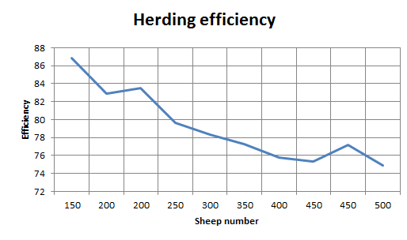
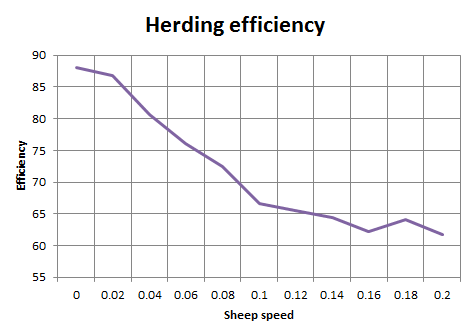

## Комп'ютерні системи імітаційного моделювання
## СПм-22-3, **Черевко Володимир Геннадійович**
### Лабораторна робота №**1**. Опис імітаційних моделей та проведення обчислювальних експериментів

 

### Варіант 9, модель у середовищі NetLogo:
[Shepherds](http://www.netlogoweb.org/launch#http://www.netlogoweb.org/assets/modelslib/Sample%20Models/Biology/Shepherds.nlogo)

 

### Вербальний опис моделі:
Симуляція збору вівець, що блукають безладно, а пастухи намагаються зігнати їх у стадо. Чи вдасться зібрати овець в одну отару, залежить від кількості пастухів і від того, наскільки швидко вони рухаються порівняно з вівцями.

### Керуючі параметри:
- **num-shepherds** визначає загальну кількість пастухів на пасовищі.
- **num-sheep** визначає загальну кількість вівців на пасовищі.
- **sheep-speed** визначає швидкість руху вівці на кожному ігровому такті за умови, що її не переносить пастух.

### Внутрішні параметри:
- **sheepless-neighborhoods** показує скільки ділянок не мають овець на сусідніх ділянках.
- **herding-efficiency** вимірює, наскільки добре випасають овець.

### Показники роботи системи:
- ефективність випасу вівець на поточному такті симуляції. Ефективність випасання вимірюється шляхом підрахунку кількості ділянок, які не мають овець у своєму оточенні, чим більше вівчарі пасуть вівець, тим більше ділянок повинно бути порожніми.

### Недоліки моделі:
- пастухи рухаються хаотично, як при пошуку вівці, так і під час пошуку стада де її можна лишити.
- відсутність чіткого місця на пасовищі, куди всі пастухи могли б переміщувати вівець.

 

## Обчислювальні експерименти
### 1. Вплив кількості пастухів на ефективність випасу
Досліджується залежність максимальної ефективності випасу овець, протягом певної кількості тактів (1000) від кількості пастухів на пасовищі, зазначеного на початку симуляції.
Експерименти проводяться при кількості пастухів 20-100, усього 9 симуляцій.  
Інші керуючі параметри мають значення за замовчуванням:
- **num-sheep**: 150
- **sheep-speed**: 0.02

<table>
<thead>
<tr><th>Кількість пастухів</th><th>Ефективність, мах</th></tr>
</thead>
<tbody>
<tr><td>20</td><td>78.70%</td></tr>
<tr><td>30</td><td>81.58%</td></tr>
<tr><td>40</td><td>82.07%</td></tr>
<tr><td>50</td><td>83.04%</td></tr>
<tr><td>60</td><td>89.24%</td></tr>
<tr><td>70</td><td>89.27%</td></tr>
<tr><td>80</td><td>91.03%</td></tr>
<tr><td>90</td><td>90.44%</td></tr>
<tr><td>100</td><td>93.93%</td></tr>
</tbody>
</table>

Графік наочно показує, що при збільшенні кількості пастухів, збільшується ефективність випасу овець.

### 2. Вплив кількості овець на ефективність випасу
Досліджується залежність максимальної ефективності випасу овець, протягом певної кількості тактів (1000) від кількості овець на пасовищі, зазначеного на початку симуляції.
Експерименти проводяться при кількості пастухів 150-500, крок 50, усього 8 симуляцій.  
Інші керуючі параметри мають значення за замовчуванням:
- **num-shephereds**: 50
- **sheep-speed**: 0.02

<table>
<thead>
<tr><th>Кількість овець</th><th>Ефективність, мах</th></tr>
</thead>
<tbody>
<tr><td>150</td><td>86.82%</td></tr>
<tr><td>200</td><td>82.90%</td></tr>
<tr><td>200</td><td>83.50%</td></tr>
<tr><td>250</td><td>79.60%</td></tr>
<tr><td>300</td><td>78.32%</td></tr>
<tr><td>350</td><td>77.23%</td></tr>
<tr><td>400</td><td>75.80%</td></tr>
<tr><td>450</td><td>75.33%</td></tr>
</tbody>
</table>

Графік наочно показує, що при збільшенні кількості овець, зменшується ефективність їх випасу.

### 3. Вплив швидкості руху овець на ефективність випасу
Досліджується залежність максимальної ефективності випасу овець, протягом певної кількості тактів (1000) від швидкості їх руху, зазначеного на початку симуляції.
Експерименти проводяться при швидкості 0-0.2, крок 0.02 усього 11 симуляцій.  
Інші керуючі параметри мають значення за замовчуванням:
- **num-shephereds**: 50
- **num-sheep**: 200

<table>
<thead>
<tr><th>Швидкість овець</th><th>Ефективність, мах</th></tr>
</thead>
<tbody>
<tr><td>0</td><td>88.06%</td></tr>
<tr><td>0.02</td><td>86.83%</td></tr>
<tr><td>0.04</td><td>80.62%</td></tr>
<tr><td>0.06</td><td>76.04%</td></tr>
<tr><td>0.08</td><td>72.44%</td></tr>
<tr><td>0.10</td><td>66.65%</td></tr>
<tr><td>0.12</td><td>65.47%</td></tr>
<tr><td>0.14</td><td>64.48%</td></tr>
<tr><td>0.16</td><td>62.29%</td></tr>
<tr><td>0.18</td><td>64.13%</td></tr>
<tr><td>0.2</td><td>61.71%</td></tr>
</tbody>
</table>

Графік наочно показує, що при збільшенні швидкості руху овець, зменшується ефективність їх випасу.
