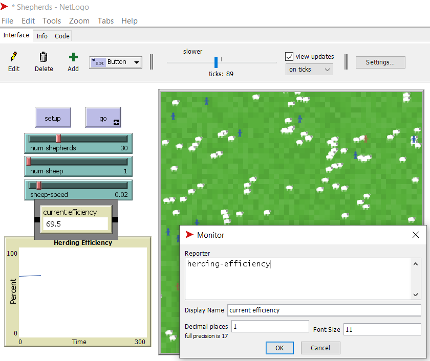
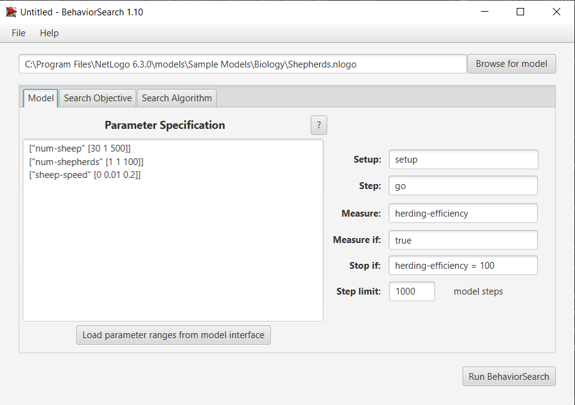
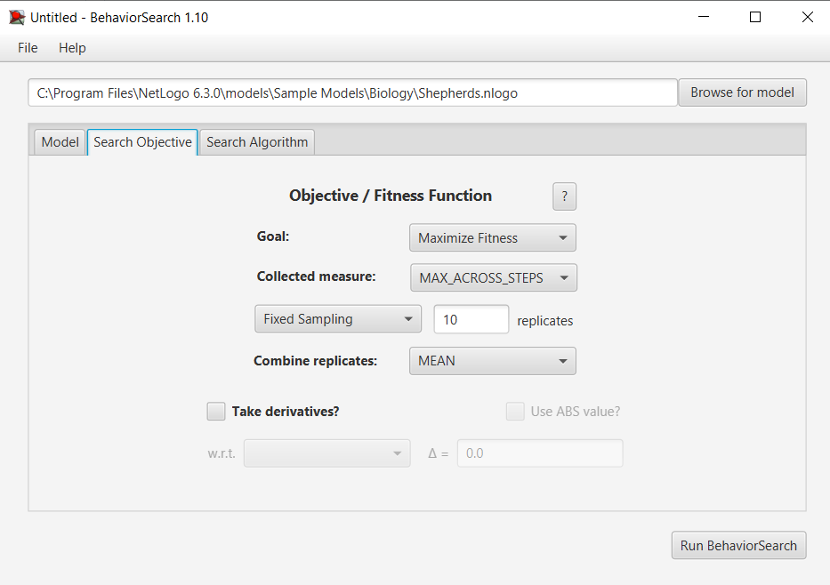
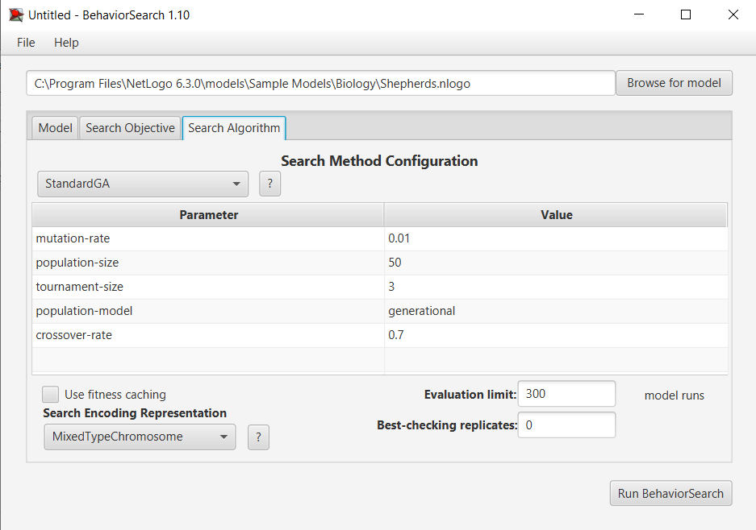
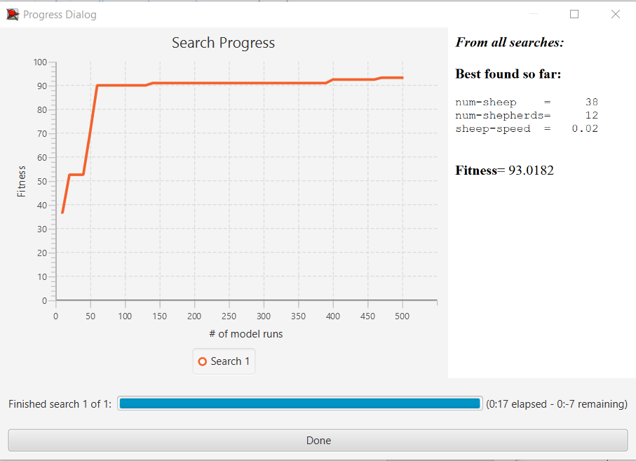
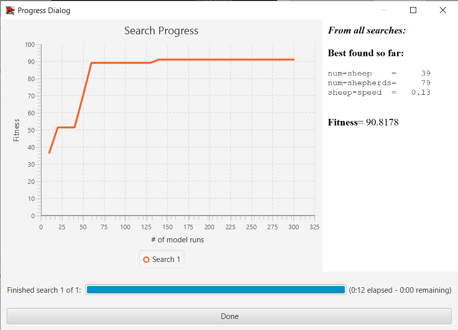

## Комп'ютерні системи імітаційного моделювання
## СПм-22-3, **Черевко Володимир Геннадійович**
### Лабораторна робота №**3**. Використання засобів обчислювального интелекту для оптимізації імітаційних моделей

 

### Варіант 9, модель у середовищі NetLogo:
[Shepherds](http://www.netlogoweb.org/launch#http://www.netlogoweb.org/assets/modelslib/Sample%20Models/Biology/Shepherds.nlogo)

 

### Вербальний опис моделі:
Симуляція збору вівець, що блукають безладно, а пастухи намагаються зігнати їх у стадо. Чи вдасться зібрати овець в одну отару, залежить від кількості пастухів і від того, наскільки швидко вони рухаються порівняно з вівцями.

### Керуючі параметри:
- **num-shepherds** визначає загальну кількість пастухів на пасовищі.
- **num-sheep** визначає загальну кількість вівців на пасовищі.
- **sheep-speed** визначає швидкість руху вівці на кожному ігровому такті за умови, що її не переносить пастух.

### Внутрішні параметри:
- **sheepless-neighborhoods** показує скільки ділянок не мають овець на сусідніх ділянках.
- **herding-efficiency** вимірює, наскільки добре випасають овець.

### Показники роботи системи:
- ефективність випасу вівець на поточному такті симуляції. Ефективність випасання вимірюється шляхом підрахунку кількості ділянок, які не мають овець у своєму оточенні, чим більше вівчарі пасуть вівець, тим більше ділянок повинно бути порожніми.

 

### Налаштування середовища BehaviorSearch:

**Обрана модель**:
<pre>
C:\Program Files\NetLogo 6.3.0\models\Sample Models\Biology\Shepherds.nlogo
</pre>
**Параметри моделі** (вкладка Model):  
Параметри та їх модливі діапазони були **автоматично** вилучені середовищем BehaviorSearch із вибраної імітаційної моделі:
<pre>
["num-sheep" [30 1 500]]
["num-shepherds" [1 1 100]]
["sheep-speed" [0 0.01 0.2]]
</pre>

Початкова кількість овець було змінено мною, в порівнянні зі значенням за замовчуванням, для коректності симуляції, оскільки BehaviorSearch пропонувал найкраще рішення при кількості овець рівне нулю.

Використовувана **міра**:  
Для фітнес-функції було обрано **значення ефективності випасання овець**, її значення для розрахунку взято з монітору, що представлений в імітаційной моделі в середовищі NetLogo  
  
та вказано у параметрі "**Measure**":
<pre>
herding-efficiency
</pre>

Значення ефективності випасання овець повинно братися **максимальне** за весь період симуляції тривалістю, 1000 тактів (адже на кожному такті є своє значення ефективності випасання), починаючи з 0 такту симуляції.  
 
Параметр зупинки за умовою ("**Stop if**") досягнення максимально можливої ефективності
<pre>
herding-efficiency = 100
</pre>
Загальний вигляд вкладки налаштувань параметрів моделі:  

**Налаштування цільової функції** (вкладка Search Objective):  
Метою підбору параметрів імітаційної моделі, що описує ефективність випасу овець, є **максимізація** значення ефективності – це вказано через параметр "**Goal**" зі значенням **Maximize Fitness**. Тобто необхідно визначити такі параметри налаштувань моделі, у яких ефективність випасання овець буде максимальною. При цьому цікавить саме максимальне можливе значення ефективності в якийсь окремий момент симуляції, а не середнє значення за всю симуляцію (тривалість якої (1000 кроків) вказувалася на минулій вкладці). Для цього у параметрі "**Collected measure**", що визначає спосіб обліку значень обраного показника, вказано **MAX_ACROSS_STEPS**.  
Щоб уникнути викривлення результатів через випадкові значення, що використовуються в логіці самої імітаційної моделі, **кожна симуляція повторюється по 10 разів**, результуюче значення розраховується як **середнє арифметичне**.

Загальний вигляд вкладки налаштувань цільової функції:  

**Налаштування алгоритму пошуку** (вкладка Search Algorithm):  

У ході дослідження на лабораторній роботі використовуються два алгоритми: випадковий пошук(**RandomSearch**) і простий генетичний алгоритм (**StandardGA**).  

Загальний вид вкладки налаштувань алгоритму пошуку:  

 

### Результати використання BehaviorSearch:
Результат пошуку параметрів імітаційної моделі, використовуючи **генетичний алгоритм**:

Результат пошуку параметрів імітаційної моделі, використовуючи **випадковий пошук**:  
